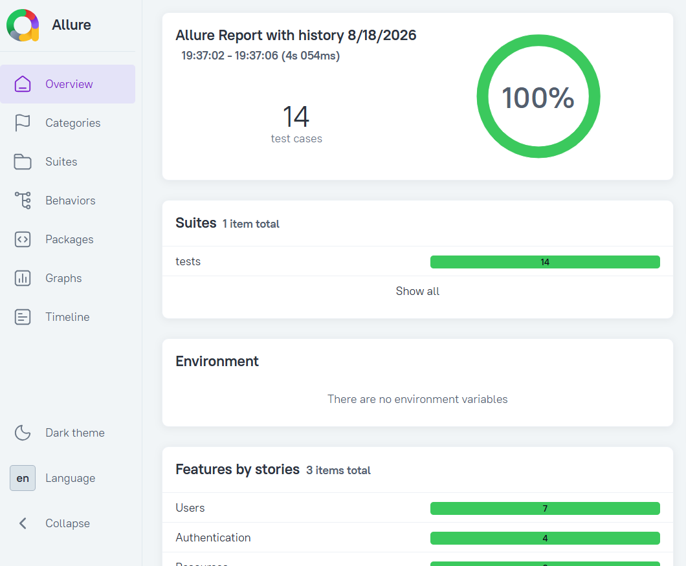

# Framework — API-автотесты для reqres.in

Фреймворк для тестирования REST API на Python: `pytest` + `requests` + `pydantic` + `allure`.

Сайт: https://reqres.in/
Для запуска тестов локально/в docker-контейнерах нужно предварительно создать свой API-key.
---

## Локальный запуск тестов в IDE

#### 1. Установка зависимостей
```
.\.venv\Scripts\activate - шаг 1. Активация виртуального окружения. Выполнять в корне проекта
uv sync - шаг 2. Установка зависимостей
pre-commit install - шаг 3. Скачивание хуков для применения конфигурации линтера к каждому коммиту. Новый код будет гарантированно форматирован согласно стандартам проекта
```

---
#### 2. Определение секретов проекта
Cоздать в корне проекта .env файл и поместить туда сгенерированный на официальном сайте API-KEY. 
Формат см. в .env.example

#### 3.Запуск тестов
Примеры конфигураций запуска:
```
pytest           - стандартный запуск. Флаги из конфига добавятся автоматически
pytest --env=dev - запуск в определённом окружении
pytest -m smoke  - запуск группы маркированных тестов
pytest -n 4      - параллельный запуск определённого числа процессов 
```
---

## Запуск тестов в Docker-контейнере

Перед запуском тестов необходимо настроить переменные окружения.

#### Переменные для запуска:
- REQRES_API_KEY (авторизационный токен. Обязательный)
- ENV (тестовое окружение. Опционально. По умолчанию 'stage')


#### Примеры настройки переменных окружения:
```
 $env:REQRES_API_KEY="значение"
 $env:ENV="dev"
```

#### Примеры команд для запуска сервиса в контейнере:
```
docker-compose up                    - стандартный запуск первый запуск всех тестов по умолчанию
docker-compose up --build            - запуск тестов с пересборкой docker-образа (при внесении изменений в Dockerfile)
docker-compose run tests -m smoke    - запуск тестов с определённым маркером 
docker-compose run tests --env=stage - запуск тестов в определённом окружении
```
После запуска тестов результаты будут доступны вне контейнера в папке /allure-results

---

### Получение доступа к allure-отчёту
После запуска тестов любыми указанными выше способами результаты будут доступны вне контейнера в папке /allure-results
```
allure serve # просмотр на локальном сервере
allure generate -c allure-results -o allure-report allure-results # генерация файлов с отчётами
```

Пример отчёта:


---

## Запуск тестов в CI/CD Pipeline
CI/CD Pipeline автоматически запускает тесты при push и при PR в ветку 'main', генерирует Allure-отчёт и публикует его на GitHub Pages. 
Отчёт доступен даже при падении тестов.


---

## Структура проекта
```
reqres_API/
├── config/
│   └── environments.py         # окружения (dev/stage) и загрузка конфига
├── services/
│   ├── base_api.py             # базовый HTTP-клиент с retry/логами/маскированием секретов
│   ├── exceptions.py           # типизированные исключения транспорта
│   └── reqres_in/
│       ├── api.py              # ReqresApi — точка входа: api.users / api.auth / api.resources
│       ├── auth/               # клиент + проверки + модели для /login и /register
│       ├── users/              # клиент + проверки + модели для /users
│       └── resources/          # клиент + проверки + модели для /resources
├── tests/
│   ├── test_auth.py
│   ├── test_resources.py
│   └── test_users.py
├── test_data/
│   ├── dev.json               # тестовые данные для окружения dev
│   └── stage.json             # для stage
├── utils/
│   └── assertions.py          # общие проверки
├── conftest.py                # общие для проекта pytest-фикстуры (env, api, cleanup, test_data)
├── pyproject.toml             # конфиг pytest + ruff
└── uv.lock                    # точные версии всех зависимостей проекта на момент последнего разрешения
└── .pre-commit-config.yaml    # конфигурация pre-commit для проверки кода перед коммитом
└── Dockerfile                 # поэтапное описание сборки проекта
└── docker-compose.yml         # конфигурация для сборки проекта с сохранением allure-отчёта на хосте
```
